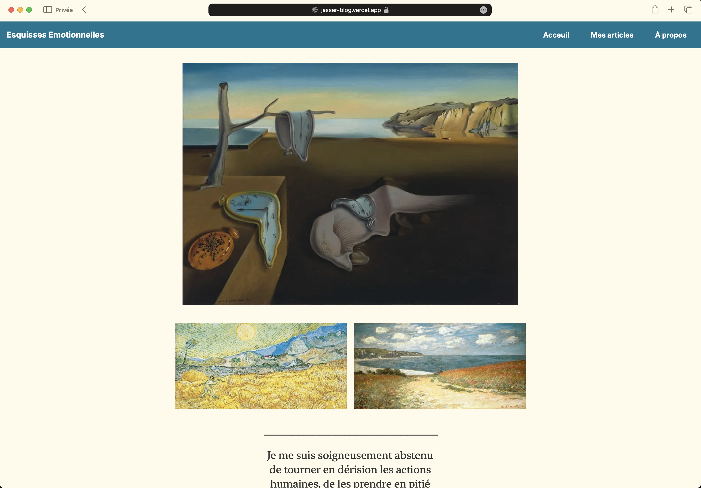

# My Blog

Welcome to my blog, built with  and hosted on . This site features articles on various topics that interest me, including [technology, poetry, politics, etc.].

You can visit my blog on [My blog](https://jasser-blog.vercel.app/)



## Features

- **Astro Framework**: Leveraging Astro's powerful static site generation for fast loading times and optimal performance.
- **Vercel Hosting**: Seamless deployment and hosting on Vercel.
- **Responsive Design**: Optimized for all devices, from desktops to mobile phones.

## Installation and Development

If you want to run this project locally or make modifications, follow the steps below.

### Prerequisites

- Node.js (v16 or later)
- npm (v7 or later)

### Getting Started

1. **Clone the Repository**:
   ```bash
   git clone https://github.com/your-username/your-blog-repo.git
   cd your-blog-repo
   ```

2. **Install Dependencies**:
   ```bash
   npm install
   ```

3. **Run the Development Server**:
   ```bash
   npm run dev
   ```

   Your site will be available at `http://localhost:3000`.

### Deployment

This site is hosted on Vercel. To deploy your own version:

1. Push your changes to your GitHub repository.
2. Connect the repository to Vercel.
3. Vercel will automatically build and deploy your site.

For more detailed instructions, visit the [Vercel documentation](https://vercel.com/docs).

## Contributing

Contributions, issues, and feature requests are welcome! Feel free to check the [issues page](https://github.com/your-username/your-blog-repo/issues) if you want to contribute.

## License

This project is licensed under the [MIT License](LICENSE).

---
