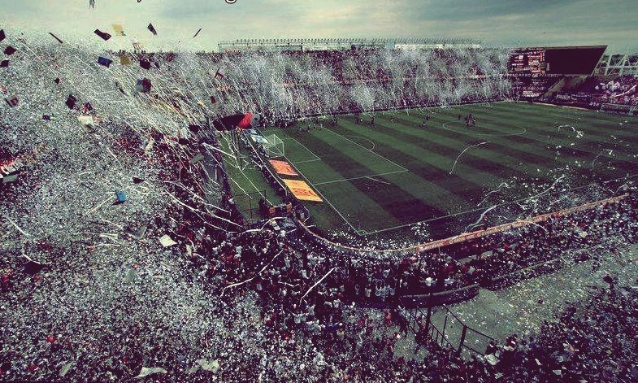

La foule exulte dans les gradins, les chants et les cris se mêlent  dans une dissonance enivrante. Le stade devient le théâtre d’une danse  frénétique, où onze hommes en maillot se démènent pour maîtriser un  ballon qui semble parfois échapper à toute logique. Le football, cet  étrange tourbillon d’efforts et d’incertitudes, s’érige en une métaphore  saisissante de l’existence humaine, à la fois absurde et passionnée.

Dans chaque pas de l’attaquant qui court pour s’emparer du ballon,  dans chaque tacle du défenseur qui défend son territoire avec ardeur,  nous pouvons entrevoir les contours de notre propre lutte pour donner un  sens à nos vies. Car comme dans le jeu du football, nos actions et nos  quêtes sont empreintes d’une imprévisibilité fondamentale. Le ballon,  comme la vie, suit sa propre trajectoire, défiant nos anticipations les  plus précises.

L’absurdité se révèle dans les moments où l’effort intense d’un  joueur peut être balayé en un instant par un coup de chance ou de  malchance. Un coup franc magnifiquement exécuté peut être stoppé par la  barre transversale, tandis qu’un tir maladroit peut se transformer en  but par une improbable série de rebonds. Le destin, dans son capricieux  jeu, se manifeste sur le terrain comme dans nos vies, nous rappelant que  nos plans et nos efforts sont souvent soumis aux lois du hasard.

Pourtant, malgré cette absurdité, la passion demeure. Elle réside  dans les cris des supporters qui expriment leurs émotions les plus  profondes, dans les joueurs qui se donnent corps et âme pour chaque  rencontre. Cette passion, ardente et pure, reflète notre propre désir de  donner un sens à nos existences, de transcender le chaos apparent pour  créer un ordre émotionnel et esthétique.

Le terrain de football devient alors un microcosme de la condition  humaine. Les victoires éphémères, les défaites déchirantes et les  moments de grâce capturés dans l’éphémère tout reflètent les hauts et  les bas de notre propre voyage. Comme le joueur qui continue à courir  malgré la futilité inhérente de la poursuite du ballon, nous poursuivons  nos aspirations, animés par l’éclat fugace de la passion.

Le football, métaphore du paradoxe absurde de l’existence, transcende  le simple jeu pour devenir une célébration de la vie elle-même. Chaque  match devient une représentation de nos propres luttes et triomphes, une  toile où l’absurde et la passion se mêlent en une symphonie unique. Et  tandis que les joueurs se battent sur le terrain, nous, en tant que  spectateurs de cet symphonie sportive, apprenons à embrasser le tumulte  de nos vies avec la même intensité passionnée.
