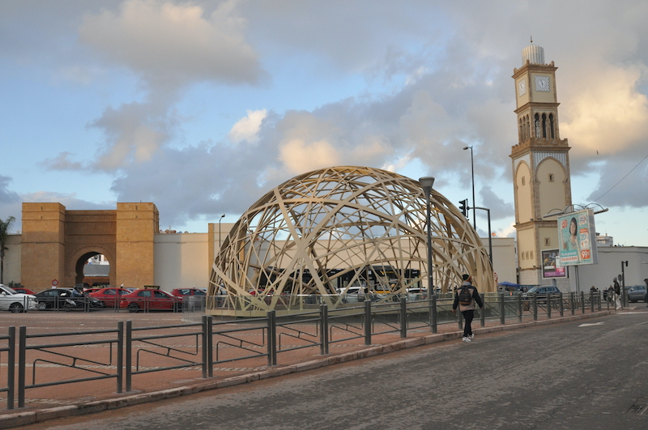

Sous le ciel impitoyable de Casablanca, le soleil projette ses rayons  ardents sur les larges avenues et les places animées de la ville. Les  rues, vastes et définies avec une absence de projection, s’ouvrent  brusquement à des lignes de tramway interminables, comme des fils de fer  barbelés égarés dans une cité déjà surchargée d’existences. Le tout  offre un contraste saisissant avec le tumulte de la vie moderne qui s’y  déroule. Connue pour son urbanisme moderne et sa quête effrénée de  progrès, cette cité se présente comme un théâtre où un homme s’engage  dans une exploration perpétuelle : la quête du sens.

Au cœur de cette mosaïque urbaine où les destinées se croisent et  s’éloignent, émerge la question fondamentale de l’existence. Les cafés  et les terrasses regorgent de conversations animées, les marchés  dévoilent leurs étalages colorés, mais derrière cette apparence animée  se profile l’ombre d’un vide existentiel. Les sourires fugaces et les  échanges éphémères laissent entrevoir l’inexorable recherche de sens,  une quête qui se nourrit des aspirations profondes de chaque individu.

Ce qui fascine avant tout dans ce tableau mouvant, ce n’est point  tant la poursuite du sens elle-même, mais plutôt les chemins singuliers  qu’on choisit pour l’arpenter. Alors que la multitude se retranche  derrière les remparts rassurants de la foi, avançant avec une piété  inébranlable, persuadée non seulement de la justesse de leur position,  mais également de la promesse d’une délivrance salvatrice, cette  assurance hautaine les conduit à juger du haut de leur hauteur  imaginaire ceux qui osent prendre une direction contraire. C’est alors  qu’on les voit se pavaner dans les rues de cette ville mouvementée,  jetant ici et là, quelques méprisants coups d’œil envers celles vêtues  de manière un tantinet révélatrice, des rires moqueurs à l’égard de tout  ce qui tend vers le modernisme.

Le dévot s’imagine à l’abri, préservé, mais derrière ces airs de  confiance se cachent des fissures, des failles dans la trame même de ses  convictions. C’est là que réside la subtilité de la condition humaine :  l’assurance superficielle dissimule souvent une profonde incertitude.

D’autres, en revanche, choisissent de plonger tête première dans la  frénésie d’une existence dépourvue de maître et de raison. Ils errent  dans les rues de Casablanca, scrutant chaque recoin comme des chercheurs  d’un trésor insaisissable. Ils sont à la quête, non pas du sens  profond, mais d’une forme d’évasion, de divertissement qui chasse  l’ennui du quotidien. Ces âmes souvent jeunes et désœuvrées  s’abandonnent aux plaisirs éphémères, cherchant peut-être dans  l’effervescence chaotique de la ville un moyen de fuir la monotonie de  l’existence.

Et puis il y a les autres les pauvres gens qui luttent pour leur  survie. Ces âmes éclipsées par l’ombre de la misère, leurs pas traînant  dans la poussière des rues, portent le fardeau d’une existence marquée  par la privation. Leurs yeux, éteints par la fatigue et la résignation,  regardent le monde d’un regard vide, tels des spectres errants dans  l’indifférence générale.

Pour eux, la quête du sens peut se résumer à la quête de la  subsistance quotidienne. Leur vie, une lutte acharnée pour se nourrir,  se vêtir et trouver un abri. Les rues de Casablanca, qui pourraient être  une arène de choix pour l’expression de l’humanité, se transforment  pour eux en terrain de bataille où chaque jour est une épreuve à  surmonter. Le sens de leur existence se réduit à l’impérieuse nécessité  de survivre.

Face à eux, le reste du monde semble souvent aveugle ou indifférent à  leur souffrance. Les passants pressés, absorbés par leurs  préoccupations, détournent parfois le regard des ombres silencieuses qui  se meuvent dans leur périmètre. Les riches continuent de vaquer à leurs  affaires, sans se rendre compte de la richesse qu’ils détiennent, la  richesse de la chance d’une vie plus clémente.

Ces vies obscures, écartées des feux de la rampe, peuvent sembler  insignifiantes dans le grand tableau qu’est cette ville. Et pourtant,  elles sont la toile de fond de cette scène complexe. Elles ajoutent une  dimension douloureuse à la quête humaine du sens, rappelant que pour  beaucoup, le sens est une question de survie.

Et au milieu de tout ces extrêmes, se tiennent les âmes lambda, les  individus ordinaires qui ont embrassé le modèle de vie dicté par la  société. Leurs pas sont rythmés par les routines, leurs regards fixés  sur l’écran des obligations quotidiennes. Ils ne cherchent pas tant le  sens que la sécurité, le confort de la conformité. Leurs vies se  déroulent comme des lignes droites tracées sur une feuille vierge, sans  les tourments de la quête incessante ou les frissons de l’audace.

Cependant, au coeur de cette mer d’incertitude, quelques esprits  éclairés émergent, porteurs d’une lueur d’espoir dans le désert de  signification. Ils offrent leurs réflexions comme autant de perles de  sagesse, invitant à scruter au-delà des apparences pour saisir la vérité  insaisissable qui réside au plus profond de chaque être.

La quête du sens dans les rues de Casablanca est un ballet complexe,  entre l’absurde et l’espoir, entre la routine et l’émerveillement, entre  la solitude et la connexion. Chaque pas, chaque regard, chaque souffle  compose une note dans la symphonie éphémère de l’existence. Et dans  cette juxtaposition de destins si variés, des croyants convaincus aux  chercheurs de divertissement, en passant par les âmes perdues et les  pauvres qui se battent pour survivre, émerge une vérité fondamentale :  la quête du sens ne se limite pas à une seule perspective. Elle prend  des formes infinies, mêlant la foi, la désillusion, la survie et  l’aspiration à un avenir meilleur. Et dans les rues de Casablanca, ces  histoires entremêlées créent un tableau complexe de l’existence humaine,  où chaque être apporte sa propre teinte à la quête universelle du sens.

Alors, si le sens ultime reste insaisissable, c’est peut-être dans  cette exploration incessante que se trouve la beauté de la vie. Car, à  l’instar des mots du plus grand des écrivains, « Au milieu de l’hiver,  j’ai découvert en moi un invincible été. »
