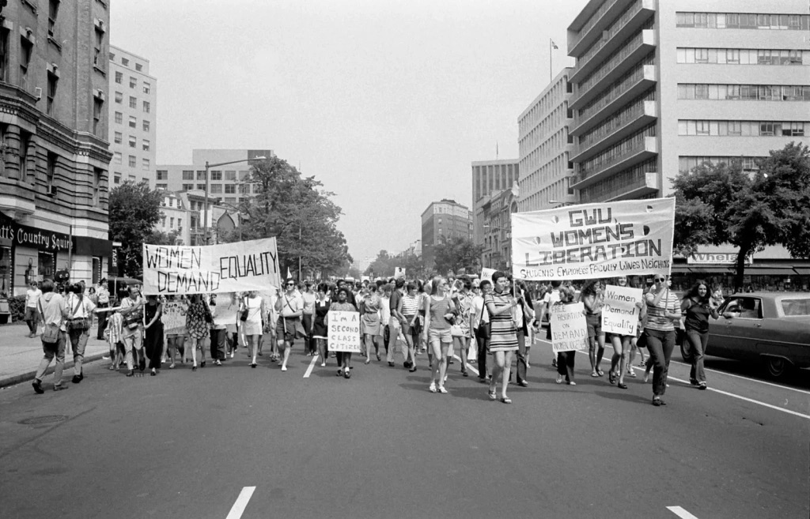

Le Maroc, terre riche d’une histoire millénaire et d’une diversité  culturelle éblouissante, fait face à des défis profonds en matière de  droits des femmes. Dans ce pays où les traditions ancestrales imprègnent  chaque aspect de la vie, les progrès en matière d’égalité des sexes  demeurent trop souvent modestes. Les avancées, bien que réelles,  semblent dépendre largement des liens étroits avec l’Europe, et  notamment la France.

La dépendance du Maroc vis-à-vis de la France, ce lien tissé au fil  des années, a apporté avec lui des vents de modernité, mais aussi des  attentes et des pressions. Les réformes législatives en faveur des  femmes, bien que modestes, sont souvent le fruit de cette influence  européenne. Cependant, cette modernisation imposée de l’extérieur n’est  qu’une peau de chagrin, recouvrant à peine les fissures d’une société  profondément patriarcale.

La réalité marocaine, avec ses ruelles étroites et ses places  grouillantes, reste une scène où les femmes évoluent en marge, dans  l’ombre des hommes. Les avancées légales, arrachées sous la pression  internationale, ne sont que des paravents fragiles. Si nos dirigeants  avaient carte blanche, ils maintiendraient les femmes enchaînées aux  traditions, esclaves des convenances et des coutumes, leurs voix  étouffées par le poids des siècles.

Le système juridique du Maroc, tel un colosse aux pieds d’argile, est  un bastion de ces valeurs patriarcales. Inspiré par des dogmes  religieux séculaires, il perpétue la domination masculine. Les lois sur  le mariage, le divorce, l’héritage, sont autant de chaînes qui entravent  les femmes. Dans les tribunaux, dans les assemblées, l’absence criante  de voix féminines renforce cette injustice systémique, solidifiant les  murs de leur prison sociale.

Pour que les femmes marocaines puissent espérer un jour respirer  l’air de la liberté, il faut plus qu’une simple pression internationale.  Il faut une révolution intérieure, un soulèvement des consciences. La  société civile, les mouvements féministes, doivent devenir les flambeaux  de cette lutte. Car ce n’est qu’en prenant en main leur destin, en  s’érigeant contre l’oppression, que les femmes pourront briser leurs  chaînes et réécrire les pages de leur histoire.

Ainsi, le chemin vers l’émancipation est parsemé d’embûches, de  combats incessants contre les forces de l’inertie. Mais dans ce combat,  il y a l’espoir d’un matin nouveau, où les femmes du Maroc marcheront la  tête haute, enfin maîtresses de leur destin, dans une société qui leur  accorde la place qu’elles méritent.
