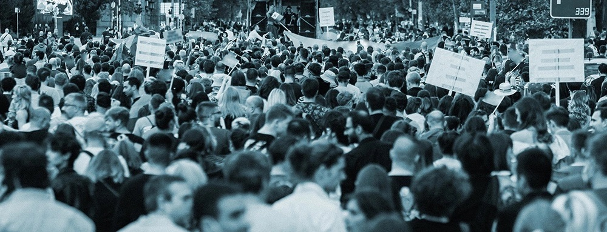

Je ne me rappelle plus par quel hasard j’étais venu à trouver le  sujet de philosophie de France de l’année 2017 : “Défendre ses droits  est-ce défendre ses intérêts ?” Depuis, cette interrogation demeure dans  mes pensées, car elle dévoile l’essence même des tumultes  socio-politiques contemporains.

Les récents événements se présentent comme un miroir où se reflètent  les luttes des étudiants en médecine et des professeurs du premier  cycle. La question qui nous hante n’est pas celle de la légitimité de  leurs combats, mais plutôt celle des motivations intimes qui les  animent. Il s’agit de discerner ce que leurs révoltes révèlent sur la  nature humaine : sont-elles le fruit d’une conscience aiguë d’une  injustice systémique, ou l’expression d’un inconfort personnel?

Prenons les étudiants en médecine. Ils s’insurgent contre des  conditions qu’ils jugent insoutenables. Mais cette indignation est-elle  née d’une véritable perception d’une injustice qui gangrène tout le  système, ou est-elle plutôt nourrie par le désir de conjurer un malaise  intime et de sécuriser un avenir professionnel plus serein? De même, les  professeurs du premier cycle, en quête de meilleures conditions de  travail et d’une reconnaissance méritée, posent une question semblable :  leurs revendications sont-elles dictées par une injustice perçue  affectant l’ensemble de leur profession, ou ne sont-elles que le reflet  d’un besoin de soulager un inconfort qui les a soudainement soulevé?

Il est indéniable qu’un mal doit être ressenti pour être combattu.  Sans la douleur ou l’inconfort personnel, l’élan pour agir manque  souvent de vigueur. Mais il faut se demander si ces injustices seraient  pourchassées avec la même ardeur si elles n’affectaient pas directement  les individus. En d’autres termes, combattons-nous l’injustice pour son  essence même, ou parce qu’elle nous blesse dans notre chair?

Cette interrogation nous pousse à sonder la justice et l’action  humaine : l’engagement pour des causes sociales est-il réellement pur de  tout intérêt personnel, ou est-il toujours teinté par des  préoccupations individuelles? Peut-on véritablement dissocier  l’injustice ressentie dans notre chair de celle perçue dans le corps  social?

La défense des droits n’est pas un simple plaidoyer pour l’intérêt  égoïste, mais plutôt le pilier d’une société harmonieuse. Car en  préservant les droits de chacun, nous érigeons les fondations d’une  communauté empreinte de confiance et de stabilité. Lorsqu’un droit est  violé, c’est l’édifice même de la légalité qui chancelle, jetant l’ombre  du doute sur nos institutions.

Non, la défense des droits ne se cantonne pas à une lutte solitaire.  Elle transcende les limites de l’individualisme pour embrasser la  solidarité et l’empathie envers autrui. Car nos droits sont tissés dans  la trame sociale, et leur protection est la garantie de notre propre  liberté.

Défendre mes droits, c’est aussi œuvrer pour que tous jouissent des  mêmes privilèges. Car la légitimité de notre plaidoyer repose sur  l’égalité et la justice. Nous ne saurions accepter une défense qui, par  sa partialité, nourrit l’injustice et la division.

Ainsi, dans cette danse complexe entre droits individuels et intérêt  commun, réside la clé d’une société plus juste, plus équitable. En  embrassant la solidarité et en érigeant l’égalité comme boussole morale,  nous pouvons, ensemble, sculpter un destin où chacun trouve sa place  dans la lumière de la dignité humaine.
