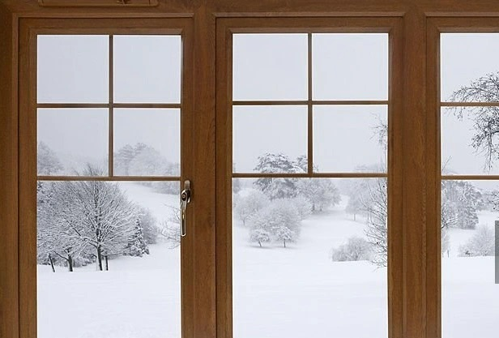

La nostalgie, fardeau léger et trompeur, nous hante par  moment comme une ombre insistante. Elle n’est pas simplement un regard  en arrière, mais un retour à des temps révolus, une quête d’un bonheur  disparu qui nous trompe avec des souvenirs embellis. Ce sentiment est  une fuite douce mais fatale, un moyen de se réfugier dans des souvenirs  déformés pour échapper aux duretés du présent. Nous croyons que le passé  était plus simple, plus pur, alors que ce n’était qu’une autre forme  d’illusion, façonnée par notre désir de trouver du sens dans un monde  qui en est dépourvue.

L’adulation des traditions est le corollaire de cette  nostalgie. Elle se manifeste comme un culte du passé, une vénération des  pratiques anciennes qui prétendent offrir une stabilité que notre  époque moderne semble incapable de fournir. Les traditions deviennent  des refuges illusoires, des ancrages dans une mer de changements  incessants. Cette adoration est une trahison du présent, une façon de se  rattacher à des valeurs dépassées alors que la société avance. En  honorant les coutumes d’antan, nous devenons prisonniers d’une nostalgie  collective, incapable de voir que le monde change et que ces traditions  ne sont plus adaptées à notre réalité.

Le paradoxe de la nostalgie et de l’adulation des  traditions réside dans leur capacité à nous faire perdre le contact avec  le présent. En nous accrochons à des visions idéalisées du passé, nous  nous déconnectons des exigences du présent, nous nous détournons des  défis et des opportunités qui se présentent à nous. Ce contraste entre  l’attachement au passé et les réalités du présent crée une tension  permanente, un conflit entre ce que nous désirons et ce que nous devons  affronter.

La nostalgie et la vénération des traditions nous  enferment dans une illusion de permanence, un refuge dans un passé qui  n’existe que dans nos rêves. Elles nous empêchent d’accepter l’absurdité  du présent, de voir que la seule véritable constante est le changement  lui-même. Pour avancer, il nous faut reconnaître cette illusion et  accepter que le passé, bien qu’ayant son importance, ne peut pas être  notre guide exclusif. Nous devons apprendre à vivre avec les  contradictions de notre époque, à embrasser le présent tout en  respectant les leçons du passé, sans nous laisser abuser par les mirages  d’un temps révolu.

Ainsi, la véritable sagesse réside dans l’acceptation de  notre condition humaine : la nostalgie et l’adulation des traditions  sont des symptômes de notre quête désespérée de sens dans un monde  déconcertant. Nous devons les voir pour ce qu’elles sont, des échos d’un  désir de stabilité dans un univers qui refuse de se laisser  apprivoiser. En les reconnaissant comme telles, nous pouvons commencer à  naviguer avec une clarté accrue, à trouver notre place dans un monde  qui avance sans cesse, sans nous laisser piéger par les illusions du  passé.

Il faut l’admettre : la nostalgie ne fait pas un projet.
