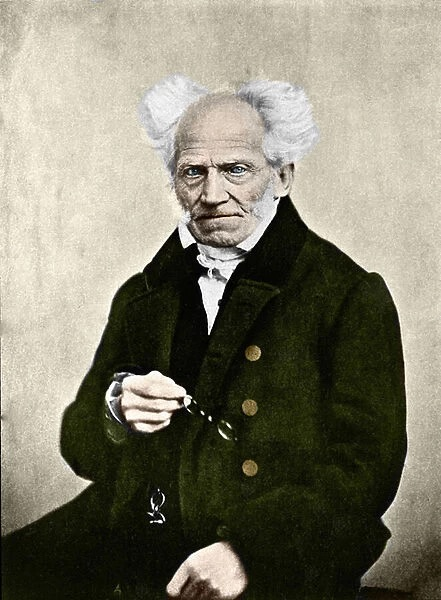

" Le seul aspect de la femme révèle qu’elle n’est destinée ni aux grands travaux de l’intelligence, ni aux grands travaux matériels. Elle paie sa dette à la vie non par l’action mais par la souffrance, les douleurs de l’enfantement, les soins inquiets de l’enfance ; elle doit obéir à l’homme, être une compagne patiente qui le rassérène. Elle n’est faite ni pour les grands efforts, ni pour les peines ou les plaisirs excessifs ; sa vie peut s’écouler plus silencieuse, plus insignifiante et plus douce que celle de l’homme, sans qu’elle soit, par nature, ni meilleure ni pire."

Ces quelques mots, qui pourraient sembler sortis d'une conversation vulgaire, entre deux hommes ordinaires d’une bassesse d’esprit incommensurable, ne le sont pourtant pas. Ils appartiennent à Arthur Schopenhauer, un esprit brillant, un homme qui, par la rigueur de son intelligence, a marqué la philosophie occidentale. Et pourtant, en entendant de tels propos, on pourrait facilement le juger grossier, même indigne d'être qualifié de philosophe, à juste titre. Mais celui qui prendrait le temps de parcourir l'ensemble de son œuvre y verrait un pilier de la pensée humaine. Alors, une question surgit, implacable : comment se peut-il qu'un esprit d'une telle envergure puisse se laisser aller à de telles infamies ?

C'est une question troublante, mais aussi inévitable. Comment un être doué d'une intelligence remarquable, capable de saisir et de décortiquer les nuances les plus subtiles de l'existence, peut-il, dans le même souffle, céder à une vision du monde si étroite, si réductrice ? La réponse se trouve peut-être dans cette évidence souvent négligée : l'intelligence, aussi puissante soit-elle, n'est pas une barrière infaillible contre les tentations plus basses, contre ces désirs irrationnels qui traversent l'âme humaine.

Il est facile de croire que l'intelligence protège de l'erreur, qu'elle élève au-dessus des passions vulgaires. Mais cette croyance est une illusion. L'intelligence peut disséquer, analyser, comprendre, mais elle est rarement à l'abri de ces mouvements obscurs qui agitent l'intérieur de l'homme. Schopenhauer, malgré la grandeur de son esprit, n'a pas échappé aux forces irrationnelles de son époque. Il a, lui aussi, succombé aux préjugés, s'est laissé emporter par la tentation de simplifier le monde pour le rendre conforme à ses désirs, à ses peurs.

Cette contradiction, entre l'intelligence et la bêtise, se trouve au cœur de la condition humaine. Nous sommes des êtres pensants, capables de raisonner, de construire des systèmes de pensée complexes. Et pourtant, cette même intelligence qui nous permet de comprendre le monde ne nous protège pas des erreurs les plus grossières. Pire encore, elle peut parfois devenir complice de la bêtise, en lui offrant des justifications savantes, en l'habillant d'une respectabilité trompeuse.

Schopenhauer, malgré son génie, n'a pas su résister à la tentation de réduire la femme à une figure secondaire, à un rôle subalterne. Il ne s'agit pas seulement d'une répétition des discours de son époque, mais bien d'un désir, profondément ancré, de dominer, de se sentir supérieur. Ce désir, irrationnel et pourtant puissant, a trouvé dans son intelligence un allié redoutable, capable de le légitimer.

L'intelligence, dénuée de toute forme d'autocritique ou de compassion, peut devenir une arme au service de la bêtise. Un esprit aiguisé peut trouver des raisons de croire en n'importe quelle absurdité, si cela satisfait un désir sous-jacent. Et c'est là le danger véritable : l'intelligence, loin de nous sauver de la bêtise, peut parfois la nourrir, la renforcer, en lui offrant des rationalisations sophistiquées.

Ainsi, Schopenhauer, en tant qu'homme, n'a pas échappé aux contradictions de sa propre nature. Ses écrits sur la femme, loin d'être un simple reflet de son temps, sont l'expression d'un besoin profond de se sentir en contrôle, de dominer. Ce besoin, cette faiblesse, a trouvé dans son intelligence une justification. Et c'est ainsi que, malgré tout son génie, il s'est laissé emporter par le désir si tentant de la bêtise.

Que peut-on dire ! L’intelligence, n’a jamais vraiment sauvé personne du désir si tentant d’être con.
