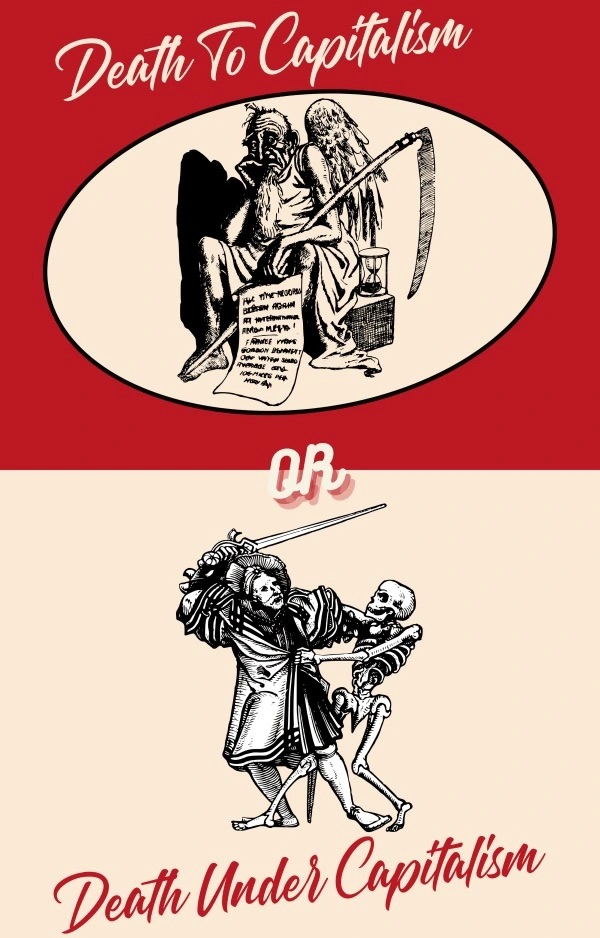

Si en Amérique, la critique du capitalisme se transforme  facilement en accusation publique, l’auteur étant condamné pour soutenir  une idéologie communiste perçue comme maléfique. Et qu’en France, le  système politique oscille toujours entre un socialisme historique,  fondement de sa société, et un capitalisme universel, garant de sa  survie. Au Maroc, en revanche, les notions de capitalisme et de  communisme semblent demeurer aussi étrangères qu’abstraites.

Pourtant, dans une ironie singulière, le Maroc est l’un  des rares pays où le capitalisme exerce une domination manifeste. Quand  je critique ce système, je ne le condamne pas entièrement. Il serait  hypocrite de ma part de rejeter un mode de vie qui, au fond, assure mon  confort quotidien.

Mon désaccord avec le capitalisme global réside dans son  aspect dévorant, négligeant les valeurs humaines au dépends d’un profit  sans cesse croissant. Dans cette logique, les individus deviennent  interchangeables, et tout est permis dès lors que cela rapporte.

Après avoir clarifié ma position, penchons nous désormais  sur le cas du Maroc. Ce pays, riche d’une histoire culturelle et humaine  unique, se trouve aujourd’hui pris au piège d’un capitalisme qui semble  déconnecté de ses traditions et valeurs.

Le Maroc, avec sa diversité culturelle et historique, est  en pleine mutation sous l’influence d’un capitalisme qui façonne son  paysage économique et social. Ce système, bien que promettant prospérité  et développement, impose une réalité où les repères culturels et  sociaux sont souvent érodés par une logique de profit.

Mais au delà de cet affrontement socioculturel, le Maroc  se trouve désormais dans une position économique complexe, où la  transformation rapide en machine à profit écrase les préoccupations  fondamentales de ses citoyens. Ce pays, longtemps marqué par la pauvreté  et les inégalités, voit aujourd’hui naître des projets ambitieux et  coûteux, financés par des investissements massifs. Ces projets  embellissent le paysage économique certes, mais cherchent avant tout à  générer des profits toujours croissants.

Cependant, cette dynamique a un revers inquiétant. Les  citoyens, censés bénéficier de cette croissance, sont souvent mis à  l’écart. Les projets ne tiennent que rarement compte des besoins sociaux  ou du bien-être général de la population. Au lieu de voir des  initiatives qui répondent à des besoins immédiats—tels que  l’amélioration des infrastructures, l’éducation ou les services de  santé, les Marocains assistent à une série de réalisations  spectaculaires, davantage préoccupées par l’accumulation de richesses  que par l’amélioration des conditions de vie.

Cette orientation vers le profit exclusif engendre un  paradoxe : bien que les investissements et les projets grandioses  puissent donner une illusion de dynamisme économique, ils sont souvent  déconnectés des réalités quotidiennes des citoyens. Les projets sociaux  et les initiatives durables qui pourraient avoir un impact direct et  positif sur la vie des habitants sont largement absents. Les grandes  réalisations immobilières et les développements spectaculaires  n’apportent que peu de bénéfices concrets à ceux qui en ont le plus  besoin.

Cette situation soulève des questions cruciales sur  l’équilibre entre la croissance économique et la justice sociale. Le  Maroc doit trouver un moyen de concilier ses ambitions économiques avec  des projets qui bénéficient réellement à ses citoyens, veillant à ce que  le développement ne se fasse pas au détriment du bien-être et de  l’inclusion sociale. Il est impératif que le pays réévalue ses priorités  et cherche à créer un modèle de croissance qui ne soit pas seulement  lucratif, mais aussi équitable et durable.
