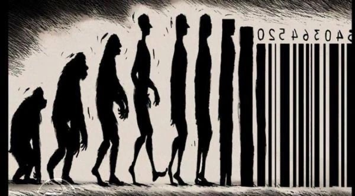

Le monde moderne, soumis aux lois impitoyables du  capitalisme globalisé, dépeint un tableau sombre où l’existence humaine  s’effrite sous la pression d’une machine vorace, perpétuellement en  quête d’expansion. Loin de s’arrêter à la simple régulation des échanges  économiques, cette force invisible et omniprésente s’insinue dans l’âme  humaine, modèle les désirs, gouverne les ambitions, jusqu’à effacer les  contours mêmes de ce qui nous rend humain. Dans ce système sans répit,  l’individu, autrefois membre d’une communauté, se transforme en acteur  solitaire, réduit à une lutte perpétuelle pour une place dans l’ordre  implacable de la consommation.

Le visage que revêt aujourd’hui le capitalisme ne se  contente pas d’exalter l’efficacité et le progrès. Il glorifie  l’égoïsme, érigeant en vertu la satisfaction immédiate des désirs  personnels. Il impose subtilement l’idée que l’existence humaine se  mesure à travers l’accumulation de biens, que chaque expérience, chaque  relation, chaque instant même a un prix. Tout peut être acheté, tout est  monnayable. Et ce n’est pas seulement la société qui en souffre. C’est  l’individu lui-même qui, perdu dans ce tourbillon de transactions, finit  par n’être plus qu’un consommateur parmi tant d’autres, hanté par une  quête de bonheur qui se dérobe à lui à mesure qu’il tente de la saisir.

Dans cette quête effrénée, le bonheur n’est plus qu’un  mirage, toujours remis à plus tard, toujours tributaire de la prochaine  acquisition, du prochain plaisir fugace. La solitude se renforce. Le  lien social s’effondre, les solidarités se dissolvent. Chaque homme  devient une île, enfermé dans ses propres ambitions, dévoré par une  obsession pour son propre intérêt. La société capitaliste ne se contente  pas de diviser les hommes; elle transforme leur nature. L’empathie, la  compassion, ces valeurs qui autrefois structuraient les relations  humaines, s’effacent devant l’indifférence froide et calculatrice d’un  système où l’autre n’est plus qu’un concurrent, un obstacle ou, pire  encore, un produit.

Mais ce qui est le plus glaçant dans cette réalité, c’est  l’idée que l’identité elle-même, cette essence intime qui devrait être  inaltérable, devient une marchandise comme les autres. Dans ce monde où  tout s’achète, la singularité de l’individu est mise en vente. Il  devient possible de changer, de se redéfinir à volonté, de se  transformer au gré des désirs du marché. Le corps, l’esprit, l’identité  ne sont plus des données immuables, mais des objets façonnables,  manipulables à l’infini. L’homme se défait de lui-même, se dissout dans  cette logique où la seule limite est celle du prix que l’on est prêt à  payer.

Cette dissolution de l’être dans le marché ne s’arrête pas  là. Les frontières autrefois si fermes entre les genres, les nations,  les morales s’effacent. Ce qui constituait la trame même de l’identité  humaine se trouve remodelé, aplati sous la pression d’une idéologie qui  prétend que tout peut être refaçonné, changé, tant que la volonté de  consommation demeure. « Je suis ce que je veux être », semble nous  murmurer ce nouveau monde, mais à quel prix ? Car si tout peut être  modifié, si chaque aspect de notre être peut être réinventé, qu’est-ce  qui reste stable, qu’est-ce qui demeure ?

Dans cette fluidité absolue, l’homme se perd. Il n’a plus  de point d’ancrage, plus de certitude. Chaque transformation, chaque  redéfinition de soi laisse un vide, une absence, un manque que rien ne  semble pouvoir combler. L’individu devient un étranger à lui-même,  ballotté par des forces qu’il ne maîtrise plus. Cette quête d’une  identité toujours renouvelée, cette promesse d’un bonheur infini par la  consommation et la transformation perpétuelle, ne mène qu’à  l’aliénation, à la perte de soi. Car si l’homme n’est plus qu’un objet  parmi d’autres, un produit dans l’immense marché du monde, alors que  vaut-il réellement ?

Ce monde sans limites, où tout peut être acheté, où  l’identité elle-même devient fluide et malléable, pose une question  cruciale : qu’est-ce qui reste de l’humain dans un tel univers ? Si tout  est interchangeable, alors rien n’a de véritable valeur. L’individu,  autrefois porteur d’une essence singulière, d’un destin propre, se  trouve réduit à une ombre, un fantôme dans une société où seule compte  la capacité à consommer, à se réinventer. Cette quête sans fin, cette  fuite en avant ne mène nulle part, sinon à l’oubli de soi et à  l’aliénation totale.
