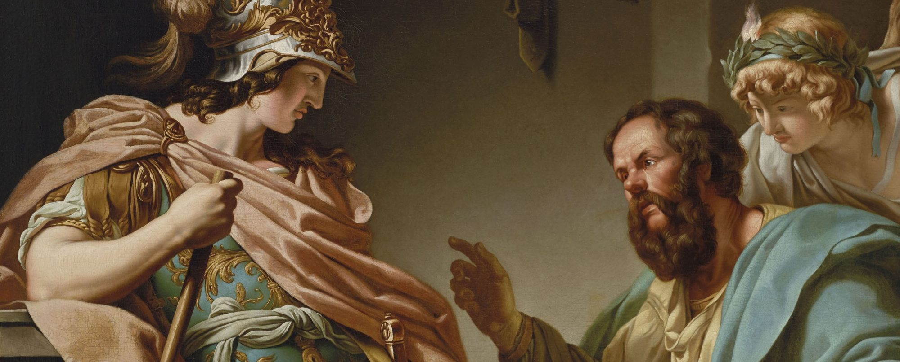

Dans "Le Banquet", Platon orchestre une scène saisissante entre Socrate et Alcibiade, où la question de la beauté s’impose. Alcibiade, auréolé de sa splendeur physique, propose à Socrate un échange insolite : unir leurs corps dans l’espoir que la beauté et la sagesse puissent se fondre, comme si la beauté du corps pouvait s’acquérir comme un bien tangible, tout comme la sagesse. Il croit que sa propre perfection physique peut être le prix de la sagesse de Socrate. Mais ce dernier, avec la sagesse sereine qui est sienne, refuse cette transaction, dévoilant une vérité plus profonde et subtile sur la nature de l’amour.

Socrate appuyant l’inéquitabilité d’un tel échange, éclaire Alcibiade d'une vérité implacable : il est plus sage de se tourner vers une beauté profonde qui est dans l’essence même de l’être aimé et dont le corps n’est que l’expression passagère. Aimer authentiquement, c’est reconnaître et chérir cette essence, cette lumière intérieure qui donne à l’autre sa valeur singulière, inaltérable par le temps. Ce n’est pas une beauté qui se fane avec l’âge ou se brise sous le poids des années. C’est une beauté qui rayonne à travers chaque geste, chaque pensée, et qui transcende le corps pour habiter l’âme, dans une éternité silencieuse.

Loin de rejeter la beauté du corps, Socrate ne prône pas un dualisme simpliste entre l’âme et le corps, l'un valant plus que l'autre. Il ne s’agit pas de tourner le dos au monde sensible, mais de percevoir, à travers les formes éphémères de ce monde, une beauté plus vaste, plus durable, plus profonde. La beauté physique est comme un reflet sur l’eau, beau mais fragile, voué à disparaître. Mais en regardant ce reflet, on peut entrevoir quelque chose de plus grand, une essence qui persiste même lorsque l’image s’estompe.

Socrate, par cette vision de l’amour, nous invite à dépasser les apparences et à saisir la véritable beauté, celle qui habite l’essence de l’autre et qui survit à la chair. Il enseigne à Alcibiade que l’amour véritable est une quête, non pas de l’apparence, mais de cette beauté intérieure qui transcende le corps et illumine l’âme. Ce que Socrate rejette n’est pas le corps, mais l’illusion qu’il peut contenir à lui seul toute la valeur d’un être. Il nous conduit ainsi à voir au-delà de l’enveloppe physique, à toucher cette part de l’autre qui échappe au temps et à la matière.

En refusant l’échange proposé par Alcibiade, Socrate fait voler en éclats l’illusion selon laquelle la beauté physique est une richesse comparable à la sagesse. Il révèle que la vraie valeur de l’être humain ne réside pas dans ce qui est visible, mais dans ce qui est éternel, dans l’âme, dans cette beauté essentielle qui, à travers le corps, ne fait que se manifester brièvement, comme une étincelle dans l’obscurité du monde. Aimer, c’est donc apprendre à voir en l’autre cette beauté imperceptible, mais impérissable, que le corps ne fait que refléter l’espace d’un instant, avant de s’évanouir.
