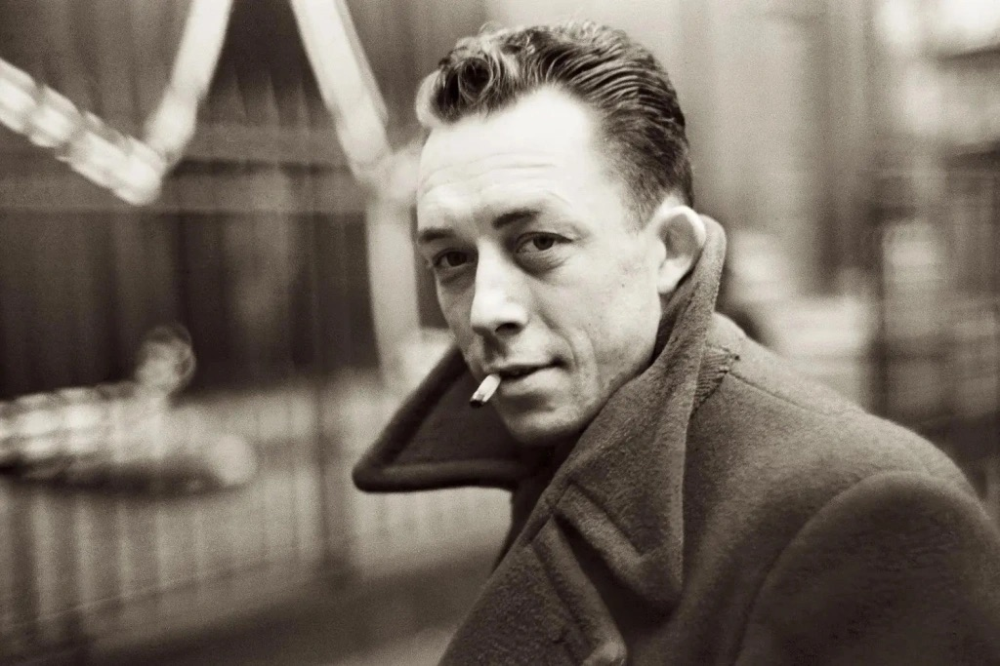

Adolescence et nihilisme, en voilà une danse dangereuse,  presque inévitable pour certains. Ma rencontre avec Emile Cioran, ce  poète du désespoir, en fut le témoin. Il y a chez lui une manière d’en  finir avec la vie dès son commencement, de condamner d’un trait brutal  la naissance comme un mal irréversible. Ce n’est pas la mort qui le  tourmente, mais cette première chute, celle d’être né, d’être projeté  dans un monde sans appel. « Avoir commis tous les crimes, sauf celui  d’être père » disait-il, comme s’il énonçait une vérité froide, figée,  impossible à contourner. Même le suicide, dans cette logique glacée,  perd tout sens. Cioran, fidèle à lui-même, affirmait que l’on meurt  toujours trop tard. Rien ne sert de hâter l’inévitable.

Mais à travers cette noirceur, il y avait autre chose,  quelque chose de plus subtil. Ce n’était pas seulement le gouffre qu’il  décrivait, mais une manière étrange de s’y tenir, de regarder le vide  sans trembler. L’absurdité, cette compagne indésirable, était peut-être  une clé, non pour échapper à la souffrance, mais pour la transcender. Et  dans ce nihilisme, j’ai découvert non pas un appel à l’abandon, mais  une invitation à vivre avec moins de fardeaux, à se libérer du poids du  monde.

C’est là que Camus est entré dans ma vie, avec cette force  tranquille qui n’avait pas besoin de crier pour se faire entendre.  L’absurde, il ne l’a pas fui, il l’a accueilli. « Il faut imaginer  Sisyphe heureux », disait-il, comme s’il voulait nous dire que l’essence  même du bonheur réside dans l’acceptation de la condition humaine. La  vie n’a pas de sens, certes, mais c’est précisément cela qui nous  libère. Il ne s’agit pas de chercher une signification cachée ou un  espoir lointain, mais de vivre pleinement dans l’instant, d’embrasser  cette absurdité et d’y puiser la force de créer son propre chemin.

Camus, pour moi le plus grand des philosophes, est un  phare dans cette nuit existentielle. Il ne promet rien, si ce n’est  cette possibilité inouïe de révolte, non contre le monde, mais contre  l’idée même du désespoir. Il m’a appris que, même face au vide, il reste  toujours quelque chose à bâtir. Le nihilisme peut jeter au fond de  l’abîme, mais Camus vous en tirera, non en niant cette chute, mais en  vous apprenant à y marcher avec légèreté. Dans cette absurdité réside  une forme de liberté, celle de créer, d’agir, d’aimer, non pas malgré  l’absence de sens, mais justement à cause d’elle. Voilà pourquoi, dans  cette quête de sens, c’est Camus qui l’a emporté, en affirmant, avec  douceur, que la vie vaut d’être vécue pour elle-même.
