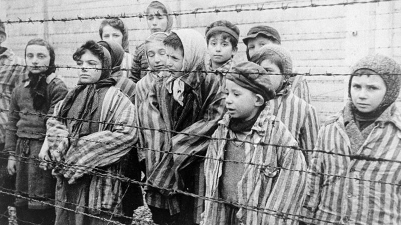

Depuis quand, dans l’histoire tourmentée des hommes, la violence  infligée a-t-elle été une sage conseillère ? Les cicatrices gravées dans  les mémoires sont un miroir étrange, réfléchissant des vérités  paradoxales. Les victimes, emprisonnées dans leur propre drame, dansent  sur le fil ténu qui sépare la justice de l’injustice, l’objectivité de  l’aveuglement. Dans le tumulte des émotions, on peut aisément confondre  ce qui est intrinsèquement injuste avec ce qui l’est seulement à travers  le prisme déformé de sa propre expérience.

Comment éviter de brouiller les eaux limpides de la justice avec les  ombres profondes de la vengeance ? Comment résister à l’envie d’inscrire  l’injustice dans une séquence sans fin en y ajoutant son antithèse ?  Les questions se multiplient comme les étoiles dans la nuit, laissant  dans leur sillage le doute et la complexité.

L’histoire, parmi ses feuillets éparpillés, garde en mémoire les mots  de Jean-Jacques Rousseau, susurrant la nécessité d’une intelligence  exceptionnelle. Une intelligence qui, telle une étoile polaire, ne se  laisse pas égarer par les passions tumultueuses de l’humanité. Une  intelligence capable de ressentir toutes les tempêtes de l’âme humaine,  tout en demeurant impassible, échappant à leurs emprises.

Cependant, lorsqu’on se trouve enchaîné dans le rôle de la victime,  la méfiance envers son propre jugement devient une lueur éclairante dans  la nuit sombre de l’adversité. Les émotions, comme des brumes épaisses,  obscurcissent la clarté du discernement. Dans notre quête de  réparation, le risque de sombrer dans la spirale de l’injustice, de  confondre le verdict éclairé avec le verdict empreint de rancœur, se  fait pressant.

Les traces du passé, les douleurs infligées, ne doivent pas dicter  l’avenir, ne pas engendrer des erreurs nouvelles dans la poursuite d’une  justice authentique. Pour démêler les fils de cette toile complexe, il  faut une lucidité imperturbable, une introspection courageuse. Car les  victimes, tout en portant les stigmates de la souffrance, portent aussi  le fardeau de la partialité.

Ainsi, dans les couloirs sombres de l’expérience humaine, il convient  de se méfier des jugements que l’on porte lorsque la lumière semble  obscurcie par les nuages de la douleur. Les échos du passé peuvent  troubler la clarté du jugement, mais en gardant les yeux rivés sur  l’horizon de la vérité, peut-être pourrons-nous naviguer au-delà des  écueils et tendre vers une forme de sagesse éclairée, au-delà de la  condition de victime.
