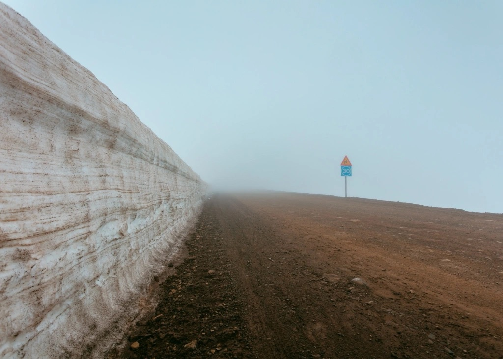

Dans le parcours d’une vie, il vient un jour où l’on se  rend compte que les chemins tracés, les repères que l’on croyait  solides, ne sont que des illusions. Nous marchons longtemps avec la  conviction que chaque direction est une réponse, un sens donné à notre  existence. Mais il suffit d’un instant pour que tout vacille. L’angoisse  de se perdre, de ne plus savoir où poser le pied, nous étreint.  Pourtant, c’est là, dans cette errance, que se révèle peut-être une  vérité plus profonde. Peut-on, en acceptant de se perdre, retrouver une  direction ? Cette question, posée au seuil du vide, n’est pas un appel  au renoncement. C’est une invitation à réinventer le sens même de ce que  signifie avancer.

Se perdre. Ces deux mots évoquent d’abord une forme  d’abandon, un lâcher-prise face à cette quête incessante de sens. Nous  vivons dans un monde où chaque tentative d’ordre se heurte à une réalité  fondamentalement désordonnée. C’est une lutte sans fin, et l’échec  semble inévitable. Mais dans cet échec, il y a peut-être la clé. Se  perdre n’est pas seulement la fin d’un chemin ; c’est le début d’un  autre. Cioran, avec son regard désabusé, avait compris que dans cette  errance réside une forme d’authenticité. L’existence est un flot  d’absurdités, et l’acceptation de cet état de fait, loin d’être un  fardeau, nous libère. Se perdre, c’est se délivrer du poids des  attentes, des certitudes qui nous enferment.

Mais cette liberté n’est pas synonyme de résignation. Non,  elle est bien plus. Si se perdre signifie reconnaître que rien n’a de  sens prédéfini, alors il nous appartient de créer ce sens. Sartre, dans  sa réflexion sur la liberté, l’a exprimé avec force : l’homme, condamné à  être libre, se trouve face à des choix dénués de sens en eux-mêmes. Se  perdre, dans cette multiplicité de possibles, devient une affirmation de  cette liberté. Dans cet acte, l’homme s’affirme comme un être libre,  maître de son destin, malgré le vertige que provoque une telle liberté.

Et c’est dans cette errance que se joue quelque chose de  plus grand. Nietzsche, avec sa destruction créatrice, pousse cette idée  jusqu’au bout. Se perdre, pour lui, c’est non seulement accepter  l’incertitude, mais l’embrasser avec une ferveur presque joyeuse. Le  chaos n’est plus une menace, mais une puissance. En brisant les vieux  repères, l’individu peut s’élever au-delà de lui-même. L’errance devient  alors ce moment où tout peut être recréé, où, libéré des illusions,  l’homme forge ses propres valeurs, trouve dans cette incertitude la  force de devenir autre.

Se perdre, dès lors, n’est plus un obstacle, mais une  opportunité. C’est dans cette errance que l’homme se redécouvre.  L’absence de direction n’est pas une fin ; elle est un commencement. Se  perdre, c’est accepter la liberté, et dans cette liberté, trouver la  puissance de créer.
