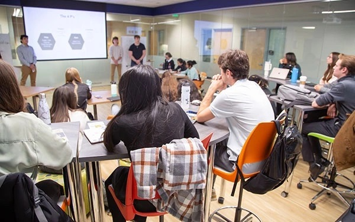

Mon parcours académique long et varié m’a fait atterrir par quelques  hasards dans un cours de marketing, discipline que, quiconque me  connaît, saurait mon mal à l’apprécier. Je me rappelle ces journées  interminables, où la lumière blanche de la salle, filtrée par les stores  usés, venait renforcer l’ennui latent qui pesait sur nous. Vous vous  doutez bien que je ne vais pas vous retranscrire le contenu du cours, ni  même vous en vanter les mérites. Ce qui m’a interpellé durant ces  heures étirées comme un jour d’été sans brise, c’est cette atmosphère  presque suffocante qui régnait alors que le professeur expliquait, avec  une insouciance glaciale, les diverses techniques que le capitalisme  avait enfantées pour nous pousser, toujours et encore, à consommer plus.

Les techniques s’étalaient, méthodiques et implacables, de la  collecte d’informations personnelles jusqu’à la manipulation la plus  insidieuse, la plus perfide… Tout y passait, avec la froideur clinique  d’un chirurgien décrivant une opération délicate. L’efficacité avant  tout, l’humain comme simple variable dans une équation à résoudre. Tout  est permis dans le monde impitoyable des affaires pourvu que ça fasse du  chiffre.

Ce qui me désolait, ce n’était pas tant le contenu du cours, aussi  contestable soit-il, mais plutôt l’indifférence tranquille de ceux qui  m’entouraient. Aucun visage ne laissait transparaître la moindre  hésitation, aucun regard ne trahissait un doute moral. Le professeur,  quant à lui, débitait ses phrases comme un automate, insensible à la  violence sous-jacente de ses propos. Je me sentais étranger parmi eux,  isolé dans ma révolte muette, tandis qu’autour de moi, on buvait ces  paroles comme une évidence, sans jamais interroger la légitimité des  méthodes exposées.

Il régnait une forme de consentement tacite, une acceptation résignée  de cet ordre du monde où tout, même les plus infimes recoins de nos  vies, devait être exploité. Je me souviens d’avoir pensé à cette célèbre  formule de Benjamin Franklin : « Time is money ». Ici, tout se  réduisait à un calcul froid, chaque interaction humaine, chaque émotion,  devenait une opportunité à capitaliser. Était-ce cela, notre avenir ?  Être des pions dans une machine implacable, complices d’un système qui  nous apprend à voir en l’autre non pas un être humain, mais un simple  consommateur à manipuler.

Ce sentiment d’étrangeté ne m’a plus quitté. À chaque minute qui  passait, je sentais s’éloigner cette illusion de choix, regrettant que  même parmi ces jeunes esprits, la critique s’éteigne si vite, consumée  par l’empire du marché. Alors, dans un ultime détachement, j’ai ouvert  mon ordinateur, cherchant refuge dans mes mots. J’ai commencé à écrire  cet article, et avant même de finir, j’ai regardé les statistiques de  mon blog. Un léger sourire m’est venu aux lèvres en voyant les chiffres  grimper : « Ah, le vendredi soir… parfait moment pour avoir le plus de  lecteurs. »
