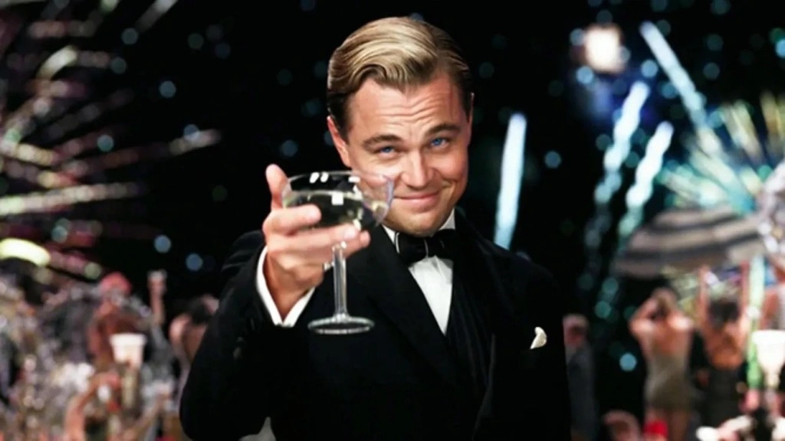

Je me souviens de cette première rencontre avec Gatsby le  Magnifique, ce roman de Fitzgerald qui, à mes douze ans, s’était  infiltré dans mon esprit comme un rêve étincelant. À cet âge, l’histoire  m’apparaissait pleine de mystère, avec des éclats de grandeur presque  insaisissables. Gatsby, ce personnage aux contours flous, portait en lui  cette persévérance inflexible, ce charme indéfinissable. Il incarnait,  pour l’enfant que j’étais, un idéal romantique. Cette passion, ce besoin  de renverser ciel et terre pour l’être aimé, m’apparaissait comme la  forme d’amour la plus authentique, peut-être la seule qui méritait  d’être vécue.

Aujourd’hui, des années plus tard, j’ai rouvert ce livre  avec une curiosité teintée de nostalgie et une pointe d’appréhension. Je  retrouvais ces mêmes dialogues, ces phrases familières qui avaient  autrefois éveillé mon imagination. Mais quelque chose avait  irrémédiablement changé. Ce Gatsby, autrefois mon héros, s’était  transformé sous mes yeux. Je ne pouvais plus le voir comme je l’avais vu  autrefois. Ce n’était plus l’amoureux sublime, mais un homme en lutte  avec ses propres mirages. Et Daisy, cette figure autour de laquelle il  avait construit sa vie, n’avait plus le même éclat. Elle me semblait  désormais ordinaire, presque mièvre, perdue dans le flot de ses  caprices. Sa quête, que je percevais jadis comme noble, m’apparaît  désormais triste, insensée, presque désespérée.

Je me retrouve désormais, au quart de ma vie, partagé  entre admiration et scepticisme. Gatsby reste pour moi une figure  admirable, mais je distingue désormais la part d’ombre qui l’accompagne,  cette folie douce qui l’éloigne de toute lucidité. L’amour, perçu trop  intensément, peut se transformer en poison, un voile qui obscurcit le  réel et nous entraîne dans des abîmes de désillusion. Pourtant, je ne  peux nier cette vérité, celle que Hopkins évoque si justement dans un de  ses meilleurs films : “To make the journey and not fall deeply in love,  well, you haven’t lived a life at all.”

Alors, comment aimer avec intensité sans sombrer dans  l’illusion destructrice ? C’est peut-être là tout l’enjeu. Trouver cet  équilibre fragile, où l’on chérit sans se perdre, où l’on rêve sans se  dissoudre.
