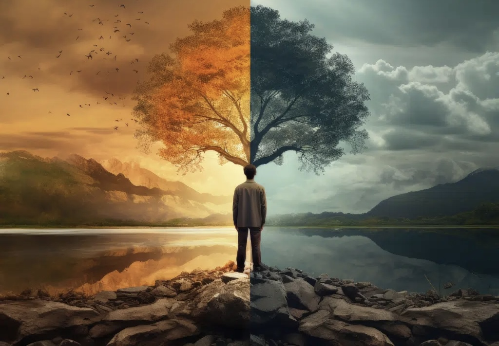

Que la vérité est fragile. Nous la tenons pour acquise, en croyant qu’un événement survenu, ou au contraire absent, existe indubitablement. Et pourtant, il suffirait de le dénigrer pour que s’efface son attachement au réel. Imaginons que deux personnes, ayant traversé la même histoire, s’en retournent en rapporter deux versions divergentes, parfois même opposées : où se niche la vérité, alors, dans ces récits ?
Supposons que l’un des deux témoins dise vrai, l’autre non. Peu importe. Les deux “vérités” s’équivalent, car personne ne peut les contredire. La distinction entre le vrai et le faux échappe ; ils possèdent chacun leur légitimité propre. Même si l’un ment volontairement, chaque récit porte en lui une part de vérité personnelle, façonnée par le vécu, modelée par l’interprétation, parfois même décrétée par la volonté. Au fond, il n’en reste qu’un fragment d’une réalité plus vaste. Et faute de pouvoir trancher entre ces récits, ils coexistent, facettes éparses d’une expérience commune, mais éminemment plurielle. Ainsi, la vérité s’efface dans un réseau d’images individuelles, chacune se voulant une version possible de la réalité, sans certitude de l’authenticité.
Dès lors, qu’est-ce que la vérité ? Une essence fixe, un fait brut indépendant de nous, ou une matière fluide, altérée par nos perceptions et désirs ? Dans l’isolement de chaque conscience, la vérité n’est-elle qu’un mirage, entretenu par la mémoire et l’habitude, comme un besoin humain de repères face au chaos du monde ? En l’absence d’une autorité pour distinguer le vrai du faux, la vérité devient-elle, fondamentalement, une construction subjective ?
Prenons cet exemple : une roche au fond d’une grotte chute, se fracassant en mille morceaux, se confondant si bien avec la texture du sol qu’on en perd la trace. Pour le philosophe Berkeley, un tel événement n’a apriori jamais eu lieu en l’absence de témoin. La réalité, pour lui, dépend de notre perception.
Cette roche, si elle n’a affecté aucune conscience, peut être considérée comme inexistante. Et même si elle a laissé une impression dans un esprit, la réalité de la chute ne persisterait que tant que l’individu en rapporte fidèlement le souvenir. S’il la renie ou la transforme, elle demeure « vraie » en dépit de sa fausseté intrinsèque. Et si deux personnes en donnent des récits divergents, leurs versions se valent, suspendant ainsi le reel entre des fragments de semi vérité et de semi mensonge.
Cette relativité dérangeante nous rappelle que la vérité n’est pas un bloc immuable. Elle se modèle sans cesse par ceux qui la portent, la vivent, et la transmettent. Elle existe peut-être moins dans l’exactitude des faits que dans l’expérience ou la volonté de rapporter honnêtement cette expérience, entre nos interprétations singulières et une réalité collective, où tout semble un équilibre précaire, prêt à basculer au moindre souffle.
Il est à déplorer que la vérité, au lieu de s’imposer d’elle-même, soit une affaire de puissance et de récit, où, comme l’exprime la fameuse expression américaine, “the winner takes it all.” Dans ce triomphe de la force sur l’authenticité, elle se transforme en l’écho de ceux qui parviennent à la dominer.
