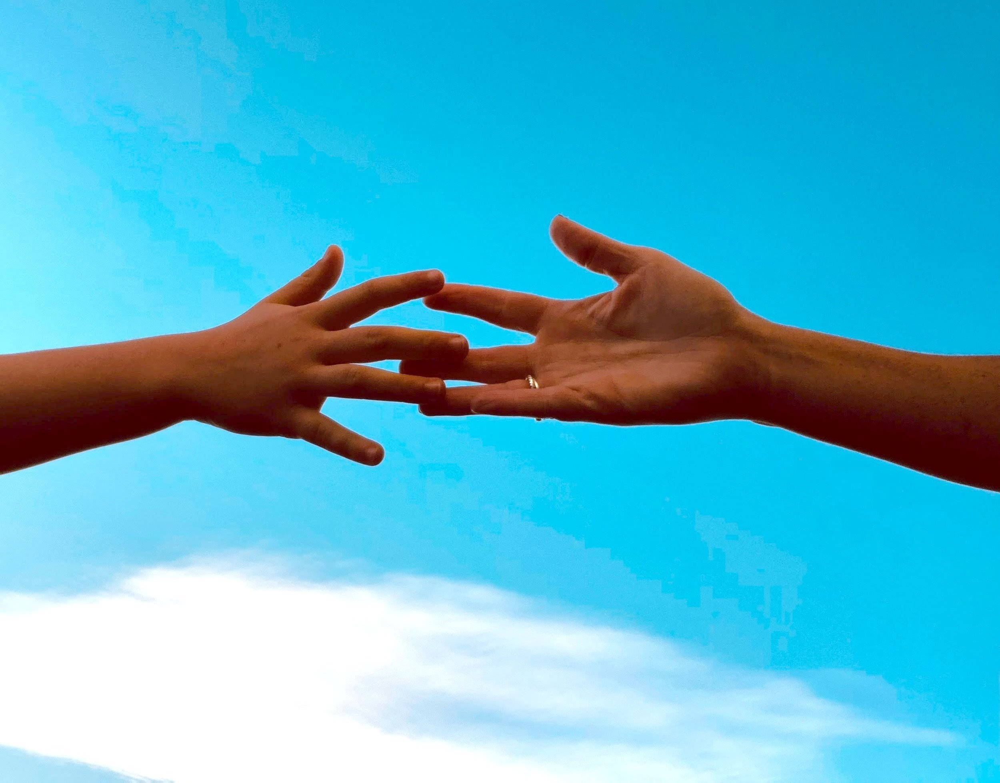

"Les gens arrivent en saisons " , " Une de perdue dix de retrouvées ", autant de refrains, de formules usées, jetées comme des pansements fragiles sur les plaies invisibles que nous laissent les autres.
Il y a dans cette idée, celle que les gens passent comme des saisons dans nos vies, un parfum d’évidence trompeuse. On pourrait presque croire que le monde y trouve un certain ordre naturel : des visages qui apparaissent, s’effacent, se dissolvent dans le cours de notre existence comme autant d’ombres soumises à une fatalité silencieuse. Mais une telle vision de l’humanité n’est-elle pas le symptôme d’un mal plus profond ? D’une peur déguisée en sagesse, d’un remède fragile contre la douleur de l’attachement ? Cette phrase, qui semble avoir puisé dans la rhétorique usée du développement personnel, invite à la retenue, au détachement, comme si chaque être devait rester à la surface de notre cœur, sans jamais en percer l’écorce.
Le détachement, tel qu’il est ici prôné, devient une armure invisible, une promesse d’immunité face à l’échec des liens humains. Pourtant, cette cuirasse a le goût amer de la solitude, de l’abandon volontaire des âmes. Elle nous entraîne vers une vision désenchantée des rencontres, où chaque relation est vouée d’avance à mourir, avant même d’avoir connu la profondeur de son propre élan. Cette idée nous fait presque croire que nous serions plus sages en nous tenant à distance, en ne permettant à personne de toucher réellement notre être, comme si l’affection elle-même ne valait que l’éphémère plaisir d’un passage.
En vérité, en nous défendant de la souffrance, nous risquons de sacrifier tout ce qui donne sens à l’existence humaine. Cette philosophie du détachement, qui semble consolante, renforce en réalité l’indifférence, nous enferme dans une existence où chaque lien est dévalué, où l’Autre n’est plus qu’un épisode, un fragment de passage destiné à disparaître, à être remplacé comme un objet qu’on jette après usage. C’est la logique froide et impersonnelle de notre époque, une société qui prône l’obsolescence comme norme, même dans le domaine le plus sacré, celui des relations humaines.
En cherchant à nous préserver, à esquiver toute émotion, nous risquons de devenir étrangers à nous-mêmes, à cette part de nous qui s’épanouit dans l’attachement, dans la vulnérabilité. À force de fuir le désordre des sentiments, de dédaigner l’amour sous prétexte de protection, nous nous condamnons à une solitude qui nous dévore lentement, qui vide nos vies de toute saveur et de toute tendresse. Car en vérité, refuser de s’attacher, c’est refuser de vivre pleinement, c’est s’enfermer dans une prison invisible, celle de la peur, de la crainte de l’autre.
Ainsi, cette prétendue sagesse du détachement, loin de nous libérer, nous aliène, nous coupe du monde. Elle nous prive de cette chaleur douce et vibrante qui seule nous donne l’illusion, pour un instant, que le bonheur est peut-être là, fragile, éphémère, mais réel. Il faut donc comme dirait Jacque Brel « Aimer jusqu'à la déchirure. Aimer, même trop, même mal » sous peine de vivre a moitié.
