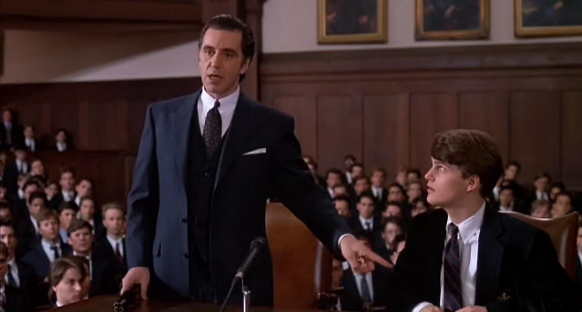

Le langage, socle ancien de la civilisation humaine, ce lien mystérieux entre les hommes, né d’un besoin simple, celui de survivre, de se comprendre dans l'obscurité de la nuit des temps, a pris, au fil des âges, un poids que nul n’aurait pu soupçonner. Il est devenu non seulement un pont entre les êtres, mais un véhicule d'idéaux et de valeurs, un témoin fragile et précieux des passions et des vérités humaines. Pourtant, dans cet étrange siècle qui est le nôtre, je vois ces mots dépérir, je les vois se vider de leur substance, se transformer en ombres, en reflets pâles d’eux-mêmes. Ils circulent partout, s’agitent sans but, se renversent et se contredisent, étouffés dans la culture du vide.

Nous sommes dans une ère de vitesse et de légèreté où les slogans éphémères remplacent les discours profonds, où les messages se compressent jusqu'à devenir insignifiants. Là où autrefois les échanges s’enrichissaient de nuances et d’écoute, ils sont aujourd’hui simplifiés, rabotés, réduits à l’essentiel, ou plutôt au superflu. Les mots, qui portaient jadis en eux la capacité de nous rapprocher, deviennent maintenant des murs, des armes qu’on brandit pour diviser, pour imposer des vérités tronquées. Le bruit a remplacé la pensée, et au milieu de cette cacophonie, il ne reste que des échanges vides, des discours que l’on oublie sitôt prononcés.
Ainsi, les mots d’amour, qui devraient brûler de sincérité, s'évanouissent comme de vulgaires phrases d’occasion, jetées dans le vent pour donner un semblant de romance. Les valeurs de liberté, de justice, de lutte, qui devraient s’imprimer en nous, ne sont plus que des slogans politiques, des mots désincarnés qu’on agite sans y croire. Les promesses se font contrats temporaires, engagements creux qu’on signe sans la moindre intention de les honorer.

Les mots s’usent, s’émoussent, et avec eux, c’est le langage tout entier qui perd son éclat, sa force d’être. Dans cette fadeur qui m’étreint, une révolte muette monte en moi. Il devient impératif de résister, non pas seulement pour sauver quelques belles phrases, mais pour préserver ce qui fait de nous des êtres de profondeur et d’empathie.

Préserver le langage, c'est aussi protéger ce qui nous distingue, ce qui nous permet de rêver ensemble et de tisser, à travers le dialogue, ce qui fait notre humanité. C’est rappeler que les mots sont des éclats de vérité et de vie, des fragments d’âme que nous devons manier avec respect. C’est lutter pour que chaque mot porte encore en lui cette lueur authentique, capable de toucher le cœur et de donner sens à nos existences.
