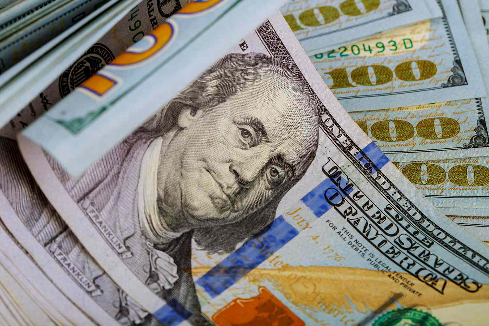

Undoubtedly, the allure of money and the pursuit of happiness are  inextricably woven into the tapestry of human desires. Money, akin to a  siren’s song, beckons us with promises of joy, and it is a desire as  potent and fervent as any other we harbor. Selfishness, much like this  alluring currency, stands as a primal motive, igniting the flames of  action within us. Among the constellation of motivations, be it charity,  narcissism, masochism, or even fear, money takes the lead, asserting  its dominance without hesitation.

Whether they toil in the crucible of grim labor or bask in the luxury  of bills turned tissue, humans are indubitably creatures in pursuit of  the monetary realm. This inclination towards wealth is a reflection of  the inherent human nature, a manifestation of the instinct to survive,  flourish, and elevate oneself.

In the grand theater of happiness, where the quest involves filling  the voids within us, money emerges as a protagonist wielding  unparalleled power. The mystique of money lies in its capacity to morph  into the very embodiment of our desires. The journey to contentment, one  could argue, is intricately intertwined with the accumulation of  wealth, which, like an enchanter, brings forth the objects of our  longing.

Could one not develop an affection for money when it guarantees not  only sustenance but also the intoxicating blend of freedom, envy, and  the respect of others? From an external vantage point, money radiates  the very aura of happiness. To be endowed with riches is to be showered  with accolades, to be enveloped in the mythos of prosperity.

Yet, beneath the sheen of opulence, a dichotomy unfurls. The  opulence, while seemingly boundless, grapples with the nagging reality  that it is an entity ultimately finite. The wealthy, cloaked in  melancholy, dance a masquerade known as the « businessman’s blues, » an  art of feigning profundity to underscore that their worth extends beyond  their holdings.

Paradoxically, having everything can be its own affliction. The  possession of abundance can breed unease, as glory withers under the  harsh gaze of time, and the intoxication of wealth can give way to the  tedium of excess. Joy is paradoxically laced with melancholy, creating a  delicate tightrope of emotions that governs the human experience.

This precarious balance gives rise to a murmuring voice, a faint  whisper of « hurry up, it won’t last. » The fragility of happiness finds  its roots in the ephemeral nature of human experiences. The transient  nature of happiness invites the haunting specter of regret, casting a  shadow over what was once a joyous moment.

Ultimately, happiness dances upon a tightrope, a tightrope that is  tethered to the uncertain whims of fate. Happiness’s capriciousness  makes it both attainable and perishable, and as its glow dims, the  specter of loss and nostalgia loom large. Happiness, ever reliant on  external factors, thrusts its subjects into the clutches of fear,  creating a fragile cage for the soul.

In contemplation, the truth unravels: happiness, for all its allure,  does not hold the key to lasting happiness. It is not the coin of the  realm that truly matters; rather, it is the intricate essence of  happiness itself. Happiness, in its delicate, transient nature, resides  not in material possessions but in the fleeting moments that sparkle  amidst the vast expanse of existence. The pursuit of happiness,  interlaced with its frivolity, is the human condition personified—a  dance between the ephemeral and the eternal, a reminder that the pursuit  itself often holds more profundity than the object of desire.
