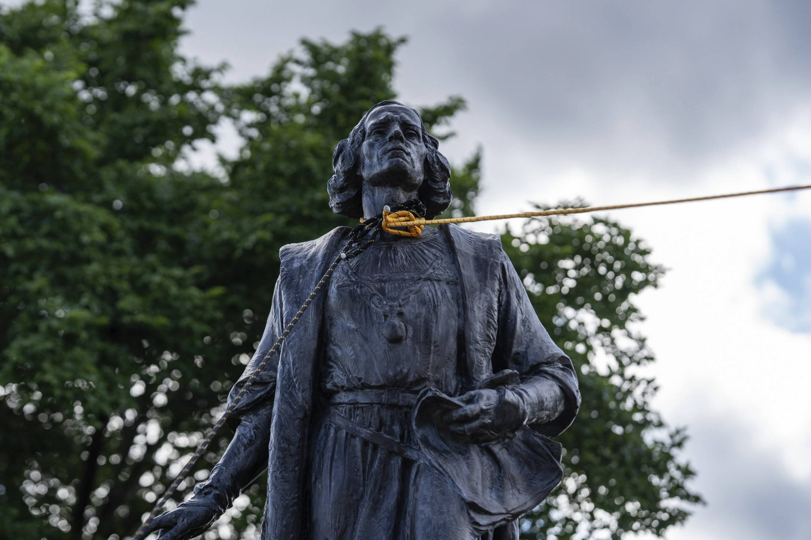

Should we pay homage to slavery? Certainly not. The concept itself  appears preposterous, akin to the grotesque shapes cast by the deepest  recesses of history’s shadows. Yet, this question unfurls its tendrils  beyond the surface, unveiling a labyrinthine complexity interwoven with  time, memory, and the very essence of human consciousness. As we stand  at this juncture, contemplating the act of erasing the tangible imprints  of a past marred by suffering, we find ourselves entangled within the  threads of illusion—an optical illusion promising to extinguish the  flames of hatred by obliterating the monuments that once bore witness to  its existence.

The statue of Christopher Columbus, now dislodged from its pedestal,  stands as a potent emblem of this pursuit. The motive, however  well-meant, glistens with the ethereal quality of a dream. For in our  quest to dismantle the symbols of oppression, we do not dismantle  oppression itself. To believe that toppling these statues equates to a  true struggle against the roots of racism is to succumb to the deceiving  allure of simplicity. The statues are mere symbols; their downfall  signifies a gesture, not a transformation.

This undertaking, adorned with the colors of progress, casts a  looming shadow of danger. It is not solely an attempt in futility, but a  risky pas de deux with history itself. The past, yearned to be expunged  from our collective narrative, remains a ghost unwilling to fade away.  This past, a mosaic of human experience woven into the fabric of  existence, resists being tethered solely to its own historical context.  It emerges, it resurfaces in unexpected ways, lying dormant in the wings  of an unborn tomorrow.

Curiously, the more we strive to erase it, the more it claims  dominion over our present. The act of erasure, an ironic homage to  memory, breathes vitality into the history we strive to relegate to  oblivion. Our attempts to shape its narrative inadvertently grant it  sovereignty, allowing it to permeate our sensibilities, our dialogues,  and our very sense of self.

And what of these fallen statues? The intent, honorable and virtuous,  collides with the chosen approach. Withholding the past—its shadows,  its agony, its monstrous facets—from the people distorts the very  essence of liberation. True liberation is not found in concealing  truths, but in exposing them. Genuine freedom arises from grappling with  history’s horrors, acknowledging the quagmire from which progress  emerges.

The chasm between intention and action is as stark as the divide  between day and night. The aspiration to untangle history’s threads from  our present is enmeshed in contradiction. An endeavor that professes  emancipation runs the risk of becoming a burden, carrying the weight of  an unaddressed past, an incomplete narrative.

The inescapable verity we confront is this: Can we genuinely break  free from history’s grasp by relegating it to obscurity? Or is our only  hope to forge an authentic, enlightened path forward by embracing  history’s spectral echoes and valiant figures under the full light of  day? To obscure the past is to disown our humanity—to reject the  struggles, the pain, and ultimately, the transcendence that emerge from  within its enduring embrace.
