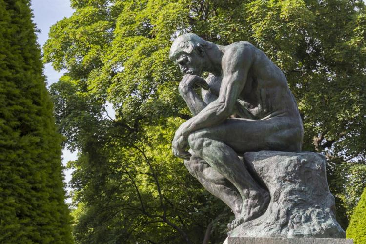

À qui, parmi les moi multiples qui se réfléchissent dans les eaux  mouvantes du temps, devrais-je  m’adresser, je l’ignore. Est-ce au moi  d’aujourd’hui, en proie aux tourments de l’existence adulte, ou bien au  moi enfant, qui autrefois rêvait de devenir ce que je suis devenu, avec  ses illusions intactes et sa candeur oubliée ? Peut-être que chacun de  ces moi, empreints de leurs propres vérités et illusions, mérite  d’entendre ces quelques mots qui résonnent comme un écho dans l’abîme de  l’âme.

Voici venu le temps tant espéré, le moment où nous touchons presque  du doigt la croisée des chemins, cet instant décisif où se joue le  destin. C’est maintenant, et seulement maintenant, qu’il nous faut  prendre position, qu’il nous faut exister pleinement. Mais au fond, que  désirons-nous vraiment être ? Jadis, l’aspiration au bonheur nous  habitait, puis nous avons compris la vanité de cette quête  insaisissable. Et pourtant, aujourd’hui, un souffle d’espoir renaît en  nous, une lueur fragile qui éclaire nos ténèbres. Comme le soulignait  avec tant de poésie Camus, « Un temps viendra où malgré toutes les  douleurs nous serons légers, joyeux et véridiques ».

Me voici donc, ignorant encore tant de choses, mais nourrissant  l’espoir le plus sincère, prêt à embrasser l’inconnu, à apprendre de  chaque instant, à me réinventer. Dans cet écheveau d’existences  entrelacées, je me tiens debout, face à l’horizon incertain de demain.  Les chemins se déploient devant moi, sinueux et mystérieux, comme autant  de promesses et d’énigmes à déchiffrer. Quel sera le chemin que je  choisirai ? Celui du conformisme rassurant ou celui de la rébellion  audacieuse ? Camus, le philosophe de l’absurde, nous enseigne que la vie  elle-même est un paradoxe, une énigme à laquelle il n’existe pas de  réponse définitive. Et pourtant, dans cette absence de sens absolu, il  trouve une beauté singulière, une invitation à créer notre propre  vérité, à trouver notre propre rédemption dans l’acte même d’exister.  Ainsi, je m’engage sur la voie de l’authenticité, de la vérité nue et  sans fard, même si cela signifie affronter les tourments de  l’incertitude et les tempêtes de l’âme. Je refuse de me laisser enfermer  dans les carcans étroits de la société, dans les conventions stériles  qui étouffent l’essence même de l’existence.

Je choisis la liberté, cette liberté intérieure qui transcende les  limites du monde matériel, cette liberté qui réside dans le pouvoir de  dire « oui » à la vie malgré tout, dans le pouvoir de créer du sens là  où il n’y en a pas, dans le pouvoir de devenir pleinement soi-même.  Et  ainsi, je m’élance, tel Sisyphe poussant son rocher maudit, non pas dans  un geste de désespoir, mais dans un acte de rébellion éclairé. Car je  le vois désormais, le véritable sens de l’existence réside dans le  mouvement même, dans le perpétuel recommencement, dans la quête  inlassable de vérité et de beauté.

Que cette lettre, adressée à moi-même et à l’enfant qui sommeille en  moi, soit le témoignage de ma résolution inébranlable, de mon engagement  envers la vie dans toute sa complexité et sa splendeur. Et que, dans  les méandres de l’existence, je trouve toujours la force d’être vrai, la  force d’être libre, la force d’être.
