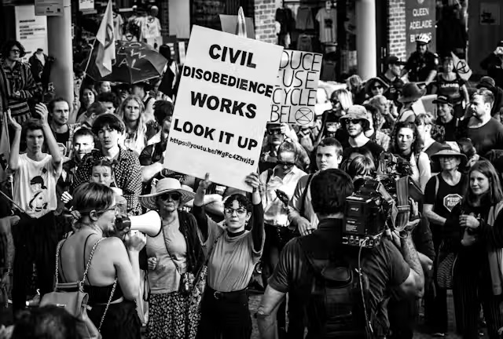

Dans l’atmosphère étouffante d’un Maroc aux fragilités croissantes,  où les vestiges d’une religiosité vacillante semblent constituer le  dernier rempart d’une société en déliquescence, la liberté apparaît  comme un mirage éloigné, déformé par les distorsions du pouvoir. Dans ce  théâtre absurde où les institutions démocratiques ne sont que des  masques, la désobéissance civile émerge comme une voix discordante, une  dissonance dans le concert des apparences.

La liberté, idéal philosophique, s’efface devant la réalité cruelle  des entraves imposées par un pouvoir oppressif. Les discours enjolivés  sur la démocratie sont des pièges, des trompe-l’œil destinés à  dissimuler les rouages d’une machinerie répressive. Les voix dissidentes  sont étouffées, les droits fondamentaux foulés aux pieds, dans une  danse macabre où la vérité est reléguée aux coulisses.

Face à cet asservissement déguisé, la désobéissance civile se  présente comme un acte de résistance, une rébellion contre l’injustice.  En refusant de se soumettre à la tyrannie des lois injustes, les  individus affirment leur autonomie, réclament leur part de liberté. Mais  ce geste de révolte n’est pas sans conséquences : ceux qui osent défier  ouvertement le régime font face à la répression brutale de ses sbires,  aux foudres de la justice dévoyée.

La désobéissance civile, dans ce contexte hostile, apparaît comme un  cri de désespoir, un ultime recours face à l’oppression. Cependant, il  faut reconnaître qu’il persiste une culture du désordre qui est  profondément enracinée dans la société marocaine, où l’incivilité est  érigée en mode de vie. C’est dans cette confrontation entre l’aspiration  à la liberté et la résignation à l’ordre établi que se joue le destin  de toute une nation, dans un théâtre où chaque acte de désobéissance est  un éclat de vérité dans l’obscurité de l’oppression.
