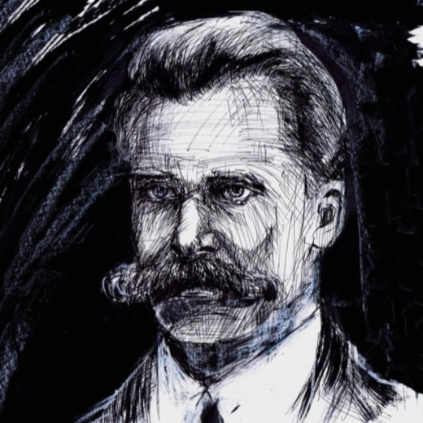

Depuis l’éclatante proclamation de Nietzsche, celle où il osait proclamer que « Dieu est mort », le monde occidental s’est engouffré dans un tumulte de reconfiguration, dans une danse effrénée avec ses propres valeurs. L’effondrement des repères traditionnels, en particulier religieux, a ouvert la voie à une libération intellectuelle, à une quête fiévreuse de nouvelles assises éthiques, sécularisées et rationalistes. Pourtant, en ce temps présent, nous sommes témoins d’un examen sans cesse croissant de ces valeurs érigées en rempart contre les anciens systèmes moraux.

Nietzsche, tel un provocateur éclairé, a amorcé ce dialogue crucial en insinuant que la disparition de Dieu exigerait la naissance de nouvelles significations et valeurs. Son appel à une « transvaluation des valeurs » fut perçu comme une invitation à repenser l’éthique dans un cadre laïc et rationnel. Ce défi audacieux fut embrassé par les penseurs ultérieurs, influençant divers mouvements philosophiques et sociaux.

Cependant, malgré ces tentatives de reconstruction morale, l’Occident contemporain semble se débattre dans une crise des valeurs rationnelles. La pensée nietzschéenne, tout en libérant des anciens dogmes, a peut-être involontairement ouvert la porte à une instabilité morale. Les fondements éthiques qui ont surgi pour remplacer les traditions religieuses sont-ils à la hauteur des défis moraux de notre époque?

Dans son plaidoyer pour la création de nouvelles valeurs, Nietzsche soulignait la nécessité de transcender les anciennes morales, apparemment dépassées par les besoins d’une société en perpétuelle mutation. Pourtant, l’évolution actuelle révèle une nouvelle crise, où même les valeurs rationnelles sont mises à l’épreuve. L’individualisme démesuré, la fragmentation sociale, les défis environnementaux soulèvent des questions cruciales sur la solidité éthique de l’héritage nietzschéen.

L’impact de Nietzsche sur la pensée occidentale se déploie dans la diversité des réponses à sa proposition de « transvaluation des valeurs ». Certains ont embrassé un relativisme éclairé, tandis que d’autres ont cherché à réaffirmer des fondements moraux plus universels. Cependant, cette multiplicité de réponses souligne également l’absence d’un consensus stable sur la nature de ces nouvelles valeurs.

En définitive, la crise des valeurs rationnelles peut être perçue comme un défi inéluctable pour l’épanouissement moral. L’apparent échec des nouvelles valeurs à fournir une boussole morale cohérente pourrait être le catalyseur d’une réévaluation profonde de notre compréhension éthique. Dans cette optique, la pensée nietzschéenne nous convie à une réflexion critique, à une exploration sans fin, à la recherche de fondations morales plus robustes pour guider l’humanité dans un monde en perpétuel mouvement.

La crise des valeurs rationnelles à laquelle nous sommes confrontés aujourd’hui peut être envisagée comme une étape inévitable dans l’évolution morale occidentale post-« mort de Dieu ». La pensée nietzschéenne, tout en éveillant le désir de forger de nouvelles valeurs, nous rappelle que cette quête morale est un processus dynamique et complexe, exigeant une réflexion constante, une adaptation aux défis contemporains.
