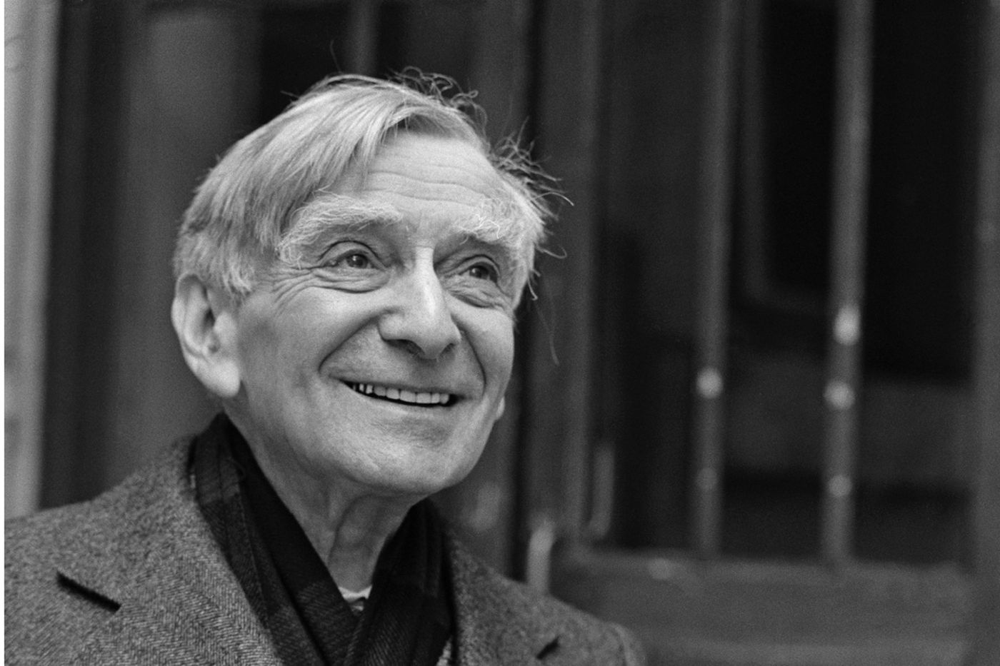

En lisant les écrits de Vladimir Jankélévitch, je me retrouve toujours face à une vision de l’amour qui transcende les simples conventions et les attentes communes. C’est une vision qui résonne profondément en moi, une conception de l’amour qui colle intimement à ma propre perception de ce sentiment insondable. Les citations de Jankélévitch m’entraînent dans une compréhension de l’amour à la fois mystérieuse et profondément touchante, évoquant les grandes envolées du romantisme tout en ancrant ses réflexions dans une rigueur philosophique indéniable.

“L’amour ne fait pas passer un examen à l’aimé avant de l’élire ; l’amour pose la valeur en aimant, comme le créateur rend le poème possible en le faisant, dans le miracle drastique de la poésie ; l’amour sans raison d’aimer trouve dans son absurdité même une cause nécessaire et suffisante !”

Cette première citation de Jankélévitch introduit une idée essentielle : l’amour authentique n’a pas besoin de justifications rationnelles. À l’instar du poète qui crée en insufflant vie à ses vers, l’amour confère de la valeur à l’être aimé simplement par l’acte d’aimer. Cette perspective rappelle les poètes romantiques qui voyaient dans l’amour une force créatrice, capable de transcender les limites du rationnel pour atteindre le domaine du miracle et du sublime.

Le philosophe va plus loin en affirmant que l’absurdité même de l’amour – aimer sans raison – est une cause nécessaire et suffisante. Cela signifie que l’amour véritable n’a pas besoin de raisons pour exister ; il se suffit à lui-même, trouvant dans son propre caractère inexplicable sa plus grande force et sa plus profonde vérité.

“L’amour ne veut rien savoir sur ce qu’il aime ; ce qu’il aime, c’est le centre de la personne vivante, parce que cette personne est pour lui une fin en soi, ipséité incomparable, mystère unique au monde. J’imagine un amant qui aurait vécu toute sa vie auprès d’une femme, qui l’aurait aimée passionnément, et ne lui aurait jamais rien demandé et mourrait sans rien savoir d’elle.”

Jankélévitch décrit ici une vision de l’amour où l’être aimé est perçu comme une fin en soi, un mystère unique et incomparable. L’amour, dans cette perspective, ne cherche pas à connaître ou à posséder. Il s’incline devant l’incompréhensible, s’enivre du mystère de l’autre sans chercher à le résoudre. Cet amour n’a ni attache ni raison, il se fixe uniquement sur l’essence même de l’amour. C’est un amour qui surgit comme une évidence, un paradoxe où la clarté du sentiment se heurte à l’obscurité de sa raison.

“C’est le seul parce que sans pourquoi.”

Cette idée est profondément radicale dans un monde où l’on cherche souvent à connaître et à justifier ce que l’on aime. Jankélévitch nous invite à envisager l’amour comme un acte de foi et de respect ultime, où le mystère de l’autre est non seulement accepté, mais célébré. C’est une forme d’amour qui trouve sa beauté et sa profondeur dans l’acceptation de l’inconnu et de l’inconnaissable.

Vladimir Jankélévitch nous offre ici une vision de l’amour qui va au-delà des attentes rationnelles. L’amour, selon lui, ne cherche pas à comprendre ou à posséder, mais célèbre l’autre comme un mystère unique, une fin en soi. C’est un amour inconditionnel et créateur, trouvant sa valeur et sa raison d’être dans son absurdité même. Dans un monde obsédé par la connaissance et la justification, Jankélévitch nous rappelle la beauté et la profondeur de l’acceptation de l’inconnu, invitant chacun de nous à embrasser l’amour comme un acte de foi un saut aveugle dans l’incommensurable, où l’âme humaine trouve sa plus haute expression.
